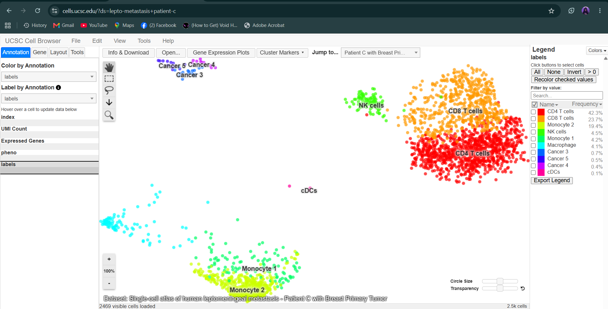
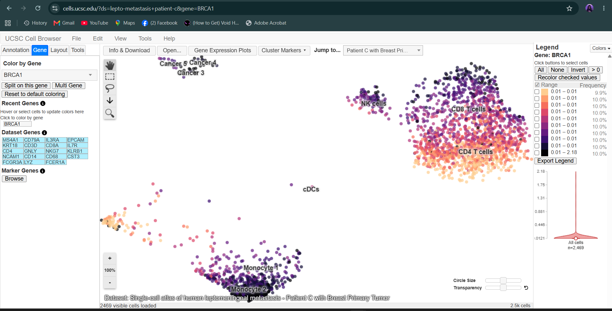
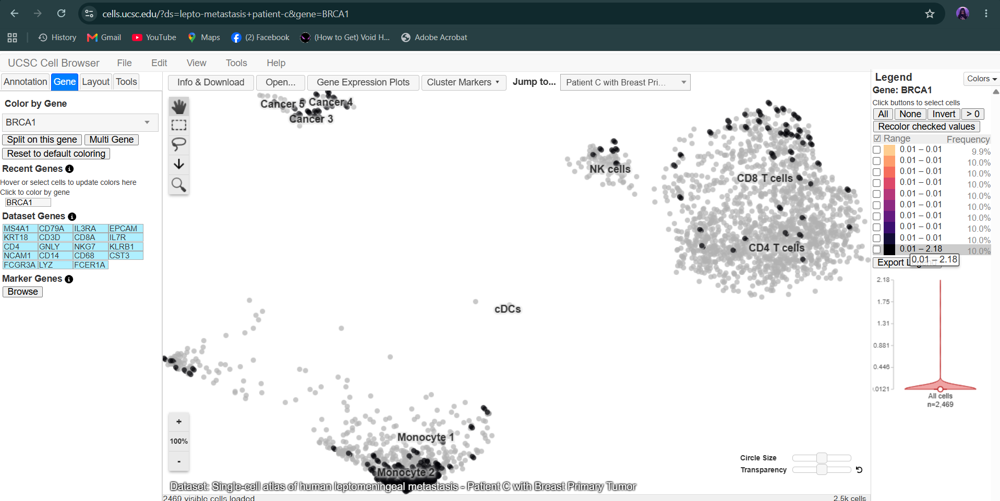
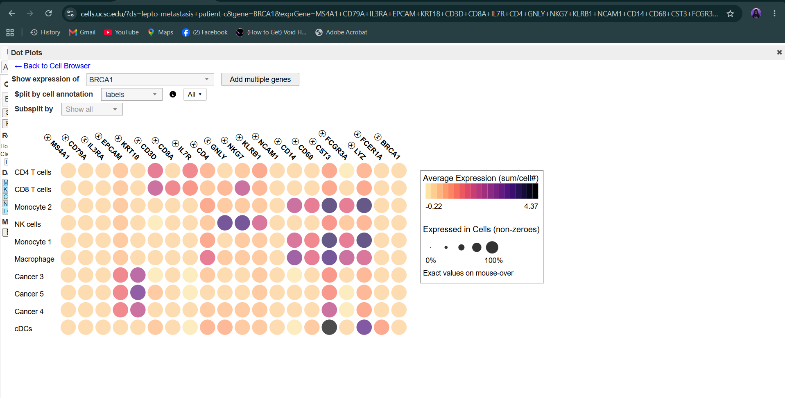
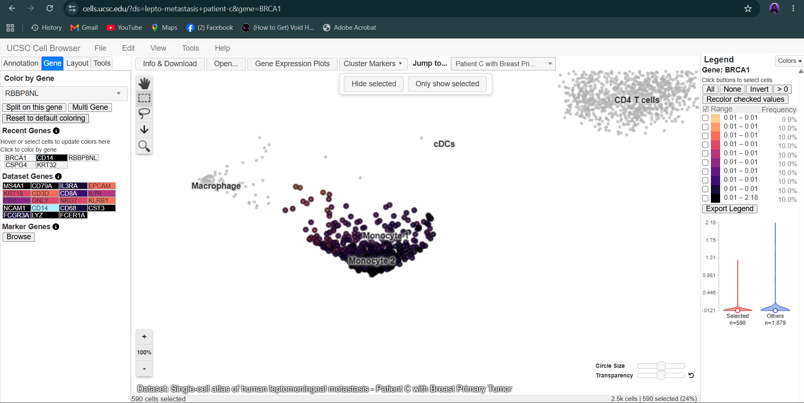
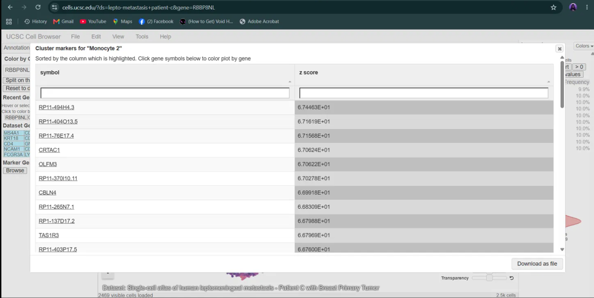
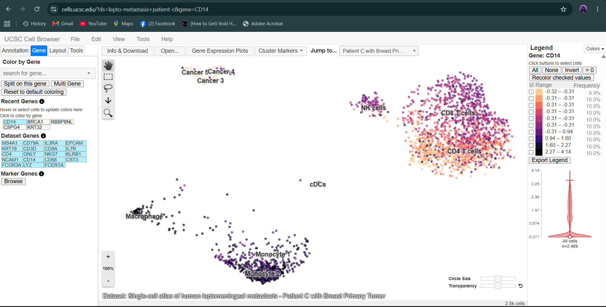

# UCSC Cell Browser Activity

**From Genome to Cell: Exploring Disease Gene Using the UCSC Cell Browser**

## 1. Assigned Gene and Disease

| | |
|---|---|
| **Assigned gene** | BRCA1 |
| **Associated disease** | Hereditary Breast and Ovarian Cancer (HBOC) |
| **Date completed** | September 25, 2026 |

This is the same gene I used in the UCSC Genome Browser and ClinVar activity above.

---

## 2. Organ/Tissue Choice and Dataset Information

**Steps I did:** I went to https://cells.ucsc.edu/ and looked for a human dataset related to breast cancer, since BRCA1 mutations mainly lead to breast and ovarian cancer. I read the dataset description first and then opened it.

| Item | What I recorded |
|---|---|
| Dataset | Single-cell atlas of human leptomeningeal metastasis, sub-dataset "Patient C with Breast Primary Tumor" |
| Study | Single-cell atlas of human leptomeningeal metastasis (as named in the dataset title) |
| Organism | Human |
| Organ/tissue | Tumor-related cells (immune cells and cancer cells) from a patient with a breast primary tumor whose cancer spread to the leptomeninges. This is not a breast-tissue-specific dataset. |
| Number of cells | 2,469 |
| Dataset URL | https://cells.ucsc.edu/?ds=lepto-metastasis+patient-c |
| Date retrieved | September 25, 2026 |

**Why this dataset is relevant:** BRCA1-related cancers start in breast epithelium, so I looked for a breast-related dataset. The dataset available to me is focused on tumor cells and not on breast tissue itself, so this patient's sub-dataset was the closest one. It comes from a patient with a breast primary tumor and contains cancer cells as well as immune cells. One limit is that it is a metastasis sample and not normal breast tissue, so its cancer cells already carry the changes of a tumor, and my results cannot show how BRCA1 behaves in normal breast cells.

**Screenshot 1: Dataset selected**

---

## 3. Understanding the Cell Map

| Question | Answer |
|---|---|
| a. Type of visualization | UMAP |
| b. What one dot represents | One single cell |
| c. What the clusters represent | Groups of cells with similar gene-expression profiles, labeled in this dataset as immune cell types and cancer cell groups |
| d. Cluster labels visible | CD4 T cells, CD8 T cells, Monocyte 2, NK cells, Monocyte 1, Macrophage, Cancer 3, Cancer 5, Cancer 4, cDCs |

Cells that are close to each other on the map have more similar overall expression, and the axes of a UMAP are not real positions in the body. There are 10 clusters. The biggest are CD4 T cells (42.3%), CD8 T cells (23.7%) and Monocyte 2 (19.4%). The three cancer clusters are very small (0.4% to 0.7% of cells) and cDCs are only 0.1%.

---

## 4. Assigned Gene Expression

**Steps I did:** I clicked the Gene tab on the left sidebar, typed BRCA1 and selected it. The map was recolored by BRCA1 expression, and I checked the legend and the violin plot.

| Question | Answer |
|---|---|
| a. Assigned gene symbol | BRCA1 |
| b. Dataset used | Single-cell atlas of human leptomeningeal metastasis, Patient C with Breast Primary Tumor |
| c. Widespread, restricted, or low/undetected? | Widespread but very low |
| d. Clusters with stronger expression | The darkest cells (about the top 10%) were packed most densely in Monocyte 2, with more scattered ones in CD8 T cells and NK cells |
| e. Clusters with little or no detectable expression | The Cancer clusters and cDCs, but these have very few cells |

The legend splits the cells into 10 groups of about 10% each. The first nine groups all read 0.01 to 0.01 and only the top group goes up to 2.18, so most cells are at or near the minimum value. The violin plot for all 2,469 cells agrees, because it is wide at the bottom and thin above. BRCA1 is therefore not strongly expressed in any cell type here, and the colors only rank the cells, so they should not be read as large differences in amount. Single-cell data also has many zero or undetected values, so a light cell does not prove that there is no BRCA1 in it.

**Screenshot 2: BRCA1 expression across the cell map**

---

## 5. Cell Types and Clusters

I kept the map colored by BRCA1 and compared it with the cluster labels. I also hovered over the legend range of the top 10% of cells so that those cells turned black and the others turned gray, which showed where the higher cells are. The exact values below come from hovering over the BRCA1 dots in the dot plot.

| Question | Answer |
|---|---|
| a. Strongest visible expression | Monocyte 2 (480 cells, average expression 0.03, with the densest group of higher cells) |
| b. Another cluster with detectable expression | CD8 T cells (584 cells, average expression 0.03) |
| c. Relatively low or undetected expression | Cancer 5 (12 cells, average expression 0.01), and the other very small clusters |
| d. Broad or cell-type restricted? | Broad |

In the dot plot, BRCA1 showed 100% non-zero cells in all the clusters I checked, which probably means the dataset gives every cell a tiny minimum value, so this number cannot separate "expressed" from "not detected". Monocyte 2 and CD8 T cells have the same average (0.03), so I cannot say that one is clearly stronger. Cancer 5 is only 12 cells, so I did not read much into its lower average.

**e. Possible biological explanation (an interpretation based on this dataset only):** BRCA1 works in DNA repair, which many kinds of cells need, so a faint signal across many cell types makes sense and does not point to one cell type. Low-level genes are also often poorly detected in single-cell data, so part of the pattern may be a detection limit. The cancer clusters are very small here, so I cannot say whether BRCA1 is really different in them.

**Screenshot 3: Top 10% of BRCA1 cells highlighted, with cell-type labels**

---

## 6. Expression Plot

**Steps I did:** I opened Gene Expression Plots and made a dot plot of BRCA1 together with 19 well-known marker genes (MS4A1, CD79A, IL3RA, EPCAM, KRT18, CD3D, CD8A, IL7R, CD4, GNLY, NKG7, KLRB1, NCAM1, CD14, CD68, CST3, FCGR3A, LYZ, FCER1A) across all 10 clusters. In a dot plot, the color shows the average expression and the dot size shows the fraction of cells with non-zero values. I then used the rectangle tool on the map to select the Monocyte 1 and Monocyte 2 area and looked at the violin plot.

| Question | Answer |
|---|---|
| a. Which cells did I select? | Monocyte 1 and Monocyte 2 (590 cells, 24% of the dataset), compared with 1,879 other cells |
| b. Selected vs. comparison cells | Similar. Both groups sit mostly at the bottom (near 0.01), and the selected group's highest values reach about 1 while the other cells reach up to 2.18 |
| c. What the plot adds | See below |

**c.** The UMAP colors alone made the monocytes look important, but the violin plot showed that the monocyte cells are not higher than the other cells. The dot plot also put BRCA1 next to real markers. The markers are dark in only one or a few clusters, for example CD3D and CD8A in T cells, NKG7 and GNLY in NK cells, CD14, CD68 and LYZ in monocytes and macrophages, and EPCAM and KRT18 in the cancer clusters. BRCA1 stayed the same pale color in every cluster, which is hard to see on the UMAP alone.

**Screenshot 4: Dot plot of BRCA1 and marker genes**

**Extra: violin plot of the selected monocytes vs. other cells**

---

## 7. Marker Genes

**Steps I did:** I clicked Cluster Markers, chose the labels annotation, and selected Monocyte 2, which is a large cluster of 480 cells that also had the densest group of higher BRCA1 cells. The table was sorted by z score.

| Question | Answer |
|---|---|
| a. Cluster examined | Monocyte 2 |
| b. Marker gene 1 | CRTAC1 |
| c. Marker gene 2 | OLFM3 |
| d. Marker gene 3 | CBLN4 |

The top of the table was mostly clone IDs (RP11-494H4.3, RP11-404O13.5, RP11-76E17.4), so I recorded the three named genes that came next. These three are not known monocyte genes, and the high z scores (about 67) are probably because the table also ranks genes with almost no signal. I earlier tried the Cancer 3 cluster, whose top markers include KRT32, CSPG4 and RBBP8NL, but these genes were near zero when I colored the map (the legend read 0.00 to 0.00), so I could not use them. The real monocyte markers (CD14, CD68, CST3, LYZ) are better seen in the dot plot.

**e. Does BRCA1 behave like a cell-type marker here?** No. A marker should be strong in one cluster and weak in the others, but BRCA1 had the same pale average in every cluster of the dot plot. This fits a DNA repair gene that many cells need, not a gene that gives a cell its identity.

**Screenshot 5: Monocyte 2 and its marker-gene table**

---

## 8. Disease Gene vs. Marker Gene

Because the top genes in the Monocyte 2 table had no real signal, I used CD14 as the marker gene. CD14 is a well-known monocyte/macrophage marker, it is in the dataset's gene list, and the dot plot shows it clearly in Monocyte 2.

| Item | Answer |
|---|---|
| a. Assigned disease gene | BRCA1 |
| b. Marker gene | CD14 |
| c. More cell-type-restricted pattern | CD14 |
| d. More broadly expressed | BRCA1 |

The CD14 map had a real legend range (-0.32 to 4.14). The dark cells were in Monocyte 1, Monocyte 2 and the Macrophage cluster, while the T cells, NK cells and cancer clusters were light.

**e. What this comparison teaches me:** CD14 is concentrated in monocytes and macrophages, so it helps to identify those cell types. BRCA1 is spread faintly over many cell types, so it does not identify any one cell type, but it is still important for the disease. This shows that a disease-associated gene does not have to be a cell-type marker.

**Extra: CD14 expression across the cell map**

---

## 9. Connection to Genome Browser and ClinVar

The chain from my previous activity is: chromosome location, then gene structure, then disease-associated variant, then gene expression, then cell type/tissue.

**1. Chromosome location:** BRCA1 is on chromosome 17 (17q21.31), at chr17:43,044,295-43,125,364 (GRCh38), on the minus strand, and it has 23 exons in the MANE Select transcript.

**2. Variant examined:** BRCA1 c.68_69delAG (VCV000017662), a 2 bp frameshift deletion in exon 2 that ClinVar classifies as Pathogenic with expert panel review.

**3. Cell types expressing the gene:** In this dataset BRCA1 is detected at a very low level in all the clusters, including CD4 T cells, CD8 T cells, monocytes, macrophages, NK cells and the cancer clusters. The densest group of higher cells was in Monocyte 2, but its average was the same as in CD8 T cells.

**4. Does this make biological sense?** Yes. BRCA1 is a DNA repair and tumor-suppressor gene, and DNA repair is needed in many kinds of cells, especially those that divide. So a faint and broad pattern fits better than a pattern restricted to one cell type. A germline variant like c.68_69delAG is present in all the cells of a carrier, but the cancer mostly appears in breast and ovarian tissue, probably because those tissues depend strongly on BRCA1 repair. The dataset I used is focused on tumor cells and is not specific to breast tissue, and it is mostly immune cells from a metastasis, so I cannot tell from it how BRCA1 behaves in normal breast cells. The low signal may also be a detection limit of single-cell methods.

**5. Can this dataset prove the gene causes the disease?** No. It only shows where BRCA1 mRNA is detected in the cells of one patient. Expression in a cell type does not show that the gene causes the disease, and proving that needs genetic, family and functional evidence, like the kinds of evidence I described in the Genome Browser section.

---

## 10. Reflection

**1. What did the UCSC Cell Browser show you that the UCSC Genome Browser could not?**
The Genome Browser showed where BRCA1 is in the genome and what its structure looks like, but not which cells actually use it. The Cell Browser showed BRCA1 expression cell by cell, so I could compare immune cells and cancer cells.

**2. Why can the same gene have different expression levels among different cell types?**
Every cell has the same DNA, but different cell types turn on different sets of genes depending on their job and state. Things like transcription factors and how fast the cell divides change how much of a gene is made.

**3. Why should you be careful when interpreting a gene that shows zero or very low expression in single-cell data?**
Single-cell methods miss many transcripts, especially low-level ones, so many zeros are dropouts and not true absence. I also saw that genes like KRT32 and CSPG4 can look important in a table of a tiny cluster but have almost no signal on the map.

**4. Why is it useful to combine information about genomic location, genetic variants, and cell-specific gene expression?**
Location and variants tell us what the change in the DNA is and what it may do to the protein, while expression tells us in which cells the gene is active. Together they give a fuller picture of how a variant could lead to disease in particular tissues.

**5. What was the most interesting observation you made about your assigned gene?**
I expected BRCA1 to stand out in the cancer cells, but it was faint in almost every cluster, unlike a real marker such as CD14. I also found that a marker table can be misleading when the cluster is very small or the genes have almost no signal.

---

## 11. References and Links

- UCSC Cell Browser: https://cells.ucsc.edu/
- Dataset used (Single-cell atlas of human leptomeningeal metastasis, Patient C with Breast Primary Tumor), retrieved September 25, 2026: https://cells.ucsc.edu/?ds=lepto-metastasis+patient-c
- UCSC Cell Browser Getting Started Guide: https://cellbrowser.readthedocs.io/en/master/ui/getting_started.html
- UCSC Cell Browser Visualization Guide: https://cellbrowser.readthedocs.io/en/master/ui/visualization.html
- UCSC Cell Browser Analysis Guide: https://cellbrowser.readthedocs.io/en/master/ui/analysis.html
- Genome Browser and ClinVar activity: see the sections above in this README
