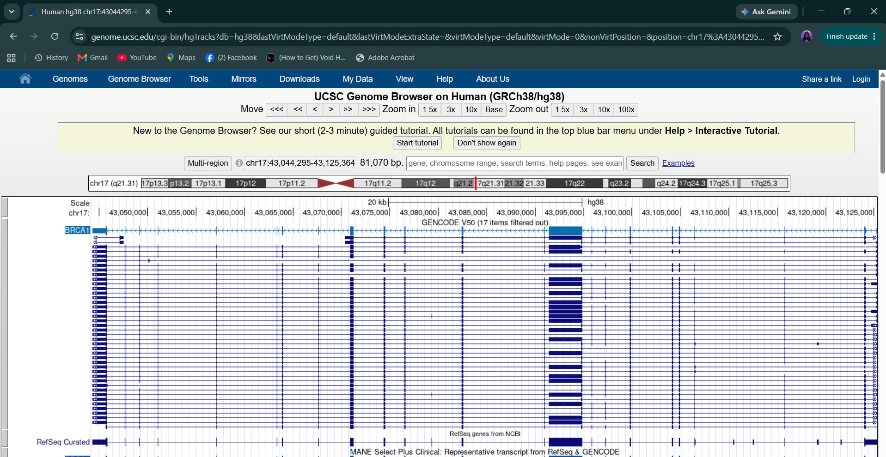
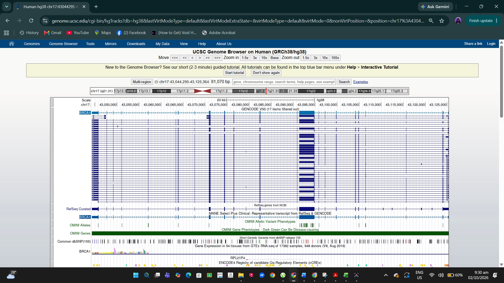
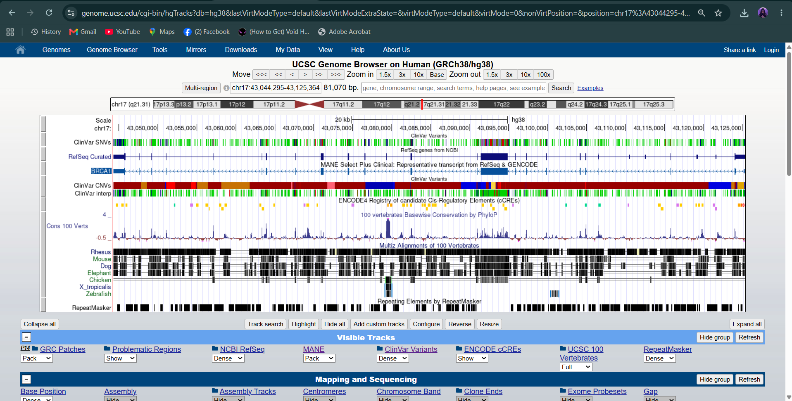
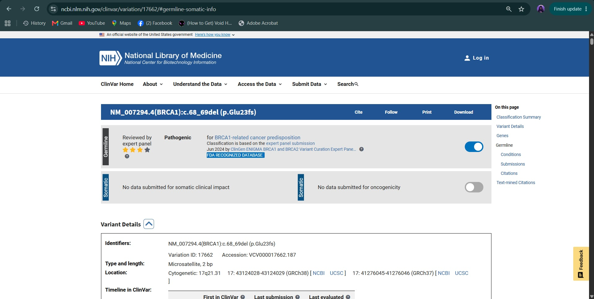
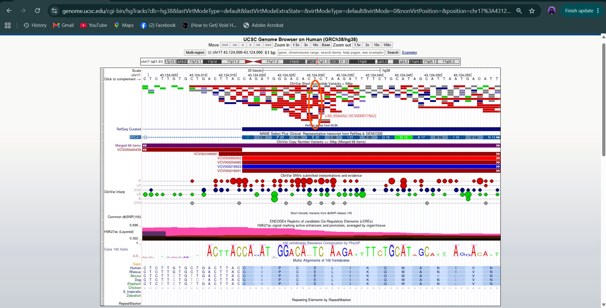

# Exploring a Human Disease Gene Using UCSC Genome Browser and NCBI ClinVar

| | |
|---|---|
| **Name** | Mary Rose V. Ferrer |
| **Assigned gene** | BRCA1 |
| **Associated disease** | Hereditary Breast and Ovarian Cancer (HBOC) |
| **Activity** | Bioinformatics Lab Activity: Exploring a Human Disease Gene Using UCSC Genome Browser and NCBI ClinVar |
| **Date completed** | September 23, 2026 |

---

## 1. Assigned Gene and Disease

The gene assigned to me is BRCA1, and the disease associated with it is Hereditary Breast and Ovarian Cancer (HBOC). I used the human genome and the GRCh38/hg38 assembly for the whole activity so that the UCSC and ClinVar coordinates match.

---

## 2. UCSC Gene Location (Part B)

**Steps I did:** I opened the UCSC Genome Browser (https://genome.ucsc.edu/), clicked Genome Browser, and chose Human with the GRCh38/hg38 assembly. I typed BRCA1 in the search box. A page with several results came up, so I picked the one for BRCA1 (NM_007294.4 / ENST00000357654.9), which opened the region containing the gene.

| Item | What I recorded |
|---|---|
| Official gene symbol | BRCA1 |
| Full gene name | BRCA1 DNA repair associated |
| Chromosome | chr17 (band 17q21) |
| Genome assembly used | GRCh38/hg38 |
| Genomic coordinates in UCSC | chr17:43,044,295-43,125,364 |
| DNA strand | Minus (-) |
| Approximate gene size | About 81 kb (81,070 bp) |

**Screenshot 1: Gene location**

---

## 3. Exons, Introns, and Transcripts (Part C)

**Steps I did:** I looked at the gene annotation tracks under the main image. The GENCODE V50 track showed many horizontal copies of BRCA1, and below it the MANE Select Plus Clinical track showed only one. I chose one transcript to count the exons: the MANE Select Plus Clinical transcript, which is NM_007294.4 (same as ENST00000357654.9). I zoomed in until the exon blocks and the connecting lines could be seen clearly.

| Item | What I recorded |
|---|---|
| Transcript I selected | NM_007294.4 (MANE Select Plus Clinical) |
| Number of exons in this transcript | 23 |
| Multiple transcripts/isoforms visible? | Yes. The GENCODE V50 track shows many isoform rows (its title says 17 items filtered out), and they use different exons or exon boundaries. |

**Exon vs. intron:** An exon is a part of the gene that stays in the mature mRNA and can code for part of the protein. An intron is the part between exons that is removed during splicing and does not end up in the final mRNA.

**Intron length:** In BRCA1 the introns look much longer than the exons. The exons are small blocks and the introns are long thin lines between them, which is normal for many human genes. The arrowheads on the intron lines point left, which agrees with BRCA1 being on the minus strand.

**Screenshot 2: Gene structure**

---

## 4. UCSC Annotation Tracks (Part D)

**Steps I did:** I scrolled below the main image to the track controls and looked for the ClinVar track. It did not show up at first, so I used Track Search and the full track-control page (Phenotypes, Variants, and Literature), turned on ClinVar Variants, set the display mode, and clicked Refresh. After that the ClinVar rows appeared. I also made sure the Conservation track (100 vertebrates Basewise Conservation by PhyloP) was visible, together with the Multiz Alignments track.

| Question | Answer |
|---|---|
| a. Gene annotation track used | MANE Select Plus Clinical (NM_007294.4), with the GENCODE V50 and NCBI RefSeq tracks also visible |
| b. ClinVar variant marks within or near the gene? | Yes |
| c. Some regions more conserved than others? | Yes |
| d. Conserved regions correspond to | Mainly the exons |

**b.** Yes, there were many ClinVar marks across the whole gene. The ClinVar interpretation track showed pathogenic, likely pathogenic, uncertain significance, likely benign and benign variants all mixed together, and in one region the marks were so crowded that they formed a solid block.

**c and d.** Some regions were clearly more conserved than others. The conservation peaks lined up with the exon positions, while the gaps between them (the introns) were much less conserved. This makes sense because the coding regions are under stronger evolutionary pressure.

**e. Why strong conservation suggests biological importance:** If a sequence stays almost the same across many species that are far apart in evolution, it means changes there were probably harmful and were removed by natural selection. So a highly conserved region is likely doing an important job, such as coding for a key part of a protein. A mutation in such a region is more likely to damage the function of the gene.

**Screenshot 3: Gene with ClinVar and Conservation tracks**

---

## 5. Selected ClinVar Variant (Part E)

**Steps I did:** I opened NCBI ClinVar (https://www.ncbi.nlm.nih.gov/clinvar/) and looked for BRCA1 variants. I chose one variant with a clear classification, the BRCA1 c.68_69delAG variant. I used the same variant as in my Galaxy mutation lab so that both activities can be compared. I opened its record and read the classification, condition, location and review status.

| Item | What I recorded |
|---|---|
| a. Gene | BRCA1 |
| b. Variant name / HGVS | NM_007294.4(BRCA1):c.68_69del (p.Glu23fs), also written c.68_69delAG or 185delAG; full protein change p.Glu23ValfsTer17 |
| c. ID | ClinVar VCV000017662 (Variation ID 17662); dbSNP rs80357914 |
| d. Chromosome and genomic position | chr17:43,124,028-43,124,029 (GRCh38); chr17:41,276,045-41,276,046 (GRCh37) |
| e. Associated condition | BRCA1-related cancer predisposition |
| f. Clinical significance (as reported) | Pathogenic |
| g. Review status | Reviewed by expert panel (3 stars), ClinGen ENIGMA BRCA1/BRCA2 Variant Curation Expert Panel, June 2024 |
| h. ClinVar record URL | https://www.ncbi.nlm.nih.gov/clinvar/variation/17662/ |

The variant type in ClinVar is a 2 bp deletion (microsatellite) in exon 2. It is a known founder mutation in the Ashkenazi Jewish population.

**Screenshot 4: ClinVar variant record**

---

## 6. Locating the Variant in UCSC (Part F)

**Steps I did:** I went back to the UCSC Genome Browser (same hg38 assembly) and typed the ClinVar coordinate chr17:43,124,028-43,124,029 in the position box. Then I zoomed out to a 61 bp window (chr17:43,124,000-43,124,060) so the nucleotide letters, the codon labels and the gene model could all be seen. To make everything fit in one screen, I hid the GENCODE, OMIM and GTEx tracks and set the ClinVar Short Nucleotide Variants track to squish mode. I compared the variant position with the MANE Select gene model right below it.

**a. Where is the variant located relative to my gene?** It is near the 5' end of BRCA1, just after the start codon, at codon 23 (the MANE track labels it E 23, which is glutamate, amino acid 23). On the minus strand it is in the second exon, about 11 bases before the end of that exon.

**b. Exon, intron, UTR, splice region, or other?** It is in an exon (exon 2). It is not at the splice site itself, but it is fairly close to the exon-intron boundary.

**c. Coding or non-coding?** It is in the coding region, because it lines up with the thick part of the gene model, which is the protein-coding part, and not with the thin UTR part. The codon labels (E 23) in the track also show that this part is translated.

One thing I noticed is that the two bases shown on the plus strand at this position are C and T. BRCA1 is on the minus strand, so the gene reads their complement, AG, which matches the deleted bases in c.68_69delAG.

**Screenshot 5: Variant located in UCSC with the gene model**

*Note: Many ClinVar variants overlap at this spot, so I marked the variant with an orange oval and a label. The ClinVar short variants track was set to squish so the whole view fits in one screenshot.*

---

## 7. Interpretation

**d. How might the variant affect the gene or gene product?** The variant deletes 2 nucleotides (AG). Since 2 is not divisible by 3, it causes a frameshift, so every codon after codon 22 is read in the wrong frame. In my Galaxy mutation lab, translating the mutant sequence gave a protein of only 38 amino acids with a premature stop at position 39, compared with 1,863 amino acids in normal BRCA1. This short protein would most likely be nonfunctional and would lose the DNA repair domains of BRCA1, and the mRNA would probably also be destroyed by nonsense-mediated decay. Losing BRCA1 function is consistent with the increased risk of breast and ovarian cancer in carriers.

**e. What additional evidence is needed before concluding the variant causes disease?** The genomic location alone is not enough. We would need functional studies showing that the protein really loses its DNA repair function, and family or case-control data showing that the variant travels with cancer in affected relatives. Population frequency data (the variant should be rare in healthy people), RNA or protein studies, and agreement between several independent labs would also help. For this variant, ClinVar already has an expert panel review, but for a new variant these kinds of evidence would still be needed.

---

## 8. Reflection (Part G)

**1. What did UCSC show you about your gene that was not obvious from simply reading about the gene's function?**
UCSC showed me that BRCA1 is a big gene of about 81 kb on the minus strand, with 23 exons separated by much longer introns. I also saw that it has many transcript isoforms, and that the part that really codes for protein is only a small piece of the whole gene. None of this was clear from reading about its DNA repair function.

**2. Why is knowing the exact genomic location of a disease-associated variant useful?**
An exact location lets me compare the same variant across different databases like UCSC and ClinVar. It also shows whether the variant is inside an exon, an intron or near a splice site, and how conserved that region is. This helps in predicting whether the variant can damage the gene or the protein.

**3. What is one limitation of predicting a variant's effect only from its genomic location?**
Location alone cannot tell the real effect of a variant. A change inside an exon can be harmless, like a silent change, while another change in the same exon can be pathogenic. Functional tests and family or population evidence are still needed.

**4. What was the most interesting feature you observed about your assigned gene?**
The most interesting thing was how crowded the ClinVar track is across BRCA1, with pathogenic, uncertain and benign variants all mixed together. I also liked that the plus-strand bases C and T at my variant position became AG on the minus strand, which matched c.68_69delAG exactly.

---

## 9. References and Links

- UCSC Genome Browser: https://genome.ucsc.edu/
- UCSC Genome Browser 101 Tutorial: https://genome.ucsc.edu/docs/tutorials/gb101.html
- NCBI ClinVar: https://www.ncbi.nlm.nih.gov/clinvar/
- ClinVar record used (BRCA1 c.68_69delAG, p.Glu23fs): https://www.ncbi.nlm.nih.gov/clinvar/variation/17662/
- ClinVar Search Help: https://www.ncbi.nlm.nih.gov/clinvar/docs/help/
